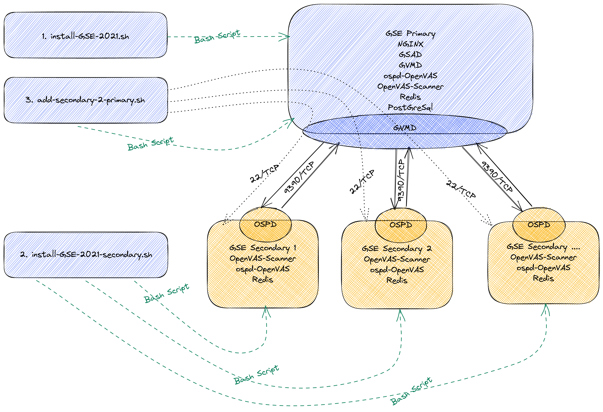
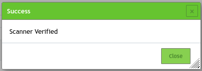
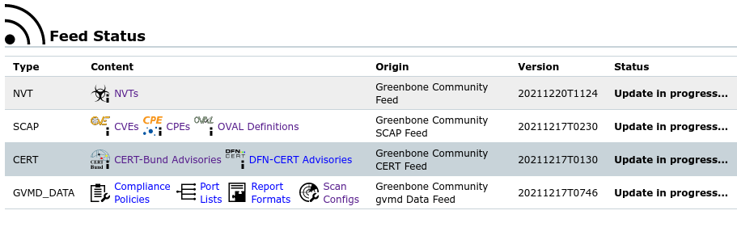
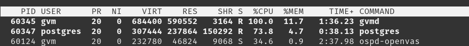
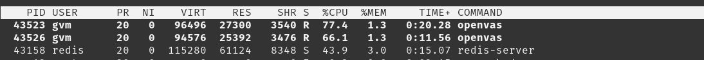

# Greenbone Vulnerability Manager 22.4.x Community Edition Installation script

### Bash script automating the installation of Greenbone Vulnerability Manager Community Version on Debian 12 (Bookworm) or Debian 11 (Bullseye)

Installation will be located in 
- /opt/gvm/ for binaries.
- /var/lib/gvm/ for gvm data CA and feed data.
- /var/lib/openvas/ for OpenVAS feed data (.nasl files)
- /var/lib/notus/ for notus feed data.

### Design principles:
  - Dedicated to GVM, nothing else.
  - Use the defaults where possible.
  - Least access.
  - Prepared for adding secondaries.

<b>Note:</b> The primary server also serves as the Certificate Authority for itself and all secondaries. But you can create a Certificate SIgning Request and send that to your corporate PKI.

During installation a GVM user called *'admin'* is created. The generated password for user admin is
stored in the file */var/lib/gvm/adminuser*. It is recommended that this password is changed and/or
the file deleted. Do NOT delete the user admin unless you also change the feedowner to another user. This is described in the section [Feed Owner](#without-a-feed-owner-there-will-be-no-feeds-ask-me-how-i-know).

To create a secondary see instructions later - but running the script _add-secondary-2-primary.sh_ does the work required on the primary as well as on the secondary, hence this is the preferred method<sup>1</sup>.

<sup>1</sup> You can install the complete installation on a secondary, that is include GVMD, GSAD etc, but there's no good reason to. The secondary with notus, ospd-openvas,
 and openvas only is a small efficient thing with a smaller attack surface.

Note: Due to the ugly hack made removing the Vagrant NIC uses (it gave me a lot of issues) use vboxmanage to control the VM afterwards, example: *vboxmanage startvm manticore --type=headless*

**Note 2023-11-04**: Used to be able to run the secondaries on 1 GB RAM and 1 shared CPU, but now need 2-4G B RAM and (preferably) 2 CPU's or better.

Versions used:
Name | URL | Version
---|---|---
gvm-libs | https://github.com/greenbone/gvm-libs/ | 22.14.0
ospd-openvas | https://github.com/greenbone/ospd-openvas/ | 22.7.1
openvas-scanner | https://github.com/greenbone/openvas-scanner/ | 23.10.0
GVM Daemon | https://github.com/greenbone/gvmd/ | 24.0.0
GSA Daemon | https://github.com/greenbone/gsad/ | 24.0.0
GSA | https://github.com/greenbone/gsa/ | 24.0.1
openvas-smb | https://github.com/greenbone/openvas-smb | 22.5.6
python-gvm | https://github.com/greenbone/python-gvm/ | 24.8.0
gvm-tools | https://github.com/greenbone/gvm-tools/ | 24.8.0
pg-gvm | https://github.com/greenbone/pg-gvm/ | 22.6.5
notus-scanner | https://github.com/greenbone/notus-scanner/ | 22.6.4
greenbone-feed-sync | https://github.com/greenbone/greenbone-feed-sync/ | 24.9.0 
Node.js for Debian 11 | https://deb.nodesource.com/ | 20.x
Node.js for Debian 12 | Debian Repo | 18.x

----

### References

[API Reference for Greenbone GMP 22.5](https://docs.greenbone.net/API/GMP/gmp-22.5.html)

### Install on Debian 11 or 12 directly (not needed when using Vagrant)

1. Modify the .env file to match your environment (especially if you need to send mail), however you may want to personalize it even further.

2. To install a primary, run: *export DEBIAN_FRONTEND=noninteractive; apt update ; apt -y full-upgrade ; apt -y install git; git clone https://github.com/martinboller/gse.git; cd gse/installfiles/; chmod 755 \*.sh; ./install-gse.sh*

3. Install secondaries by running: *export DEBIAN_FRONTEND=noninteractive; apt update ; apt -y full-upgrade ; apt -y install git; git clone https://github.com/martinboller/gse.git; cd gse/installfiles/; chmod 755 \*.sh; ./install-gse-secondary.sh*¹ - When the secondary is finished installing the script returns the hostname and password needed to connect the secondary to the primary, however if you cleared the screen or forgot it, it can be found in /var/lib/gvm/greenboneuser on the secondary scanner in question.

4. To connect the secondaries to the primary, on the primary, run: ./add-secondary-to-primary.sh and enter the hostname or ip and password for the secondary. 

5. Now use the different scripts (automatically cloned from GitHub on the primary) to create Credentials, Schedules, Targets, and Tasks (or do it manually from the Web UI). Details on the GMP Scripts can be found on [GitHub](https://github.com/martinboller/greenbone-gmp-scripts).

¹ Use install-gse-secondary.sh for all the secondaries you want to deploy.

----

## Latest changes

### 2024-10-30 - updates + changed prerequisites
- openvas-scanner v23.10.0
- pnscan for those rare cases, libssh-4 libssh-dev (libssh-gcrypt-dev obsoleted)

### 2024-10-23 - gvm-libs updated
- gvm-libs v22.14.0

### 2024-10-17 - gsa, gsad, gvmd, and gvm-libs updated
- gsa v24.0.1, gvm-libs v22.13.0, gvmd v24.0.0, and gsad v24.0.0

### 2024-10-16 - gsa web frontend updated
- gsa v24.0.1

### 2024-09-11 - Latest updates
- gvmd v23.10.0, openvas-scanner v23.9.0

### 2024-08-30 - Latest updates
- gvm-libs v22.11.0, gvm-daemon v23.9.0, gsa-daemon v22.12.0, gsa v23.3.0, gvm-tools v24.8.0, python-gvm v24.8.0

### 2024-08-21 - Latest updates
- openvas-scanner v23.8.5

### 2024-08-16 - Latest updates
- notus-scanner v22.6.4

### 2024-08-08 - Latest updates
- openvas-scanner v23.8.4

### 2024-08-03 - Latest updates
- openvas-scanner v23.8.2
- gvmd v23.8.1
- gsa v23.2.1
- python-gvm & gvm-tools v24.7.0

### 2024-07-23 - Latest updates
- openvas-scanner v23.8.0
- gvmd v23.8.0
- gsad v22.11.0 & gsa v23.2.0

### 2024-07-18 - Latest openvas-scanner v23.6.0

### 2024-07-15 - Latest openvas-scanner v23.5.2

### 2024-06-29 - Latest gsa v23.1.1
- gsa v23.1.1

### 2024-06-25 - Latest openvas-scanner, gsad
- gsad 22.10.0
- gsa v23.1.0
- openvas-scanner 23.5.0

### 2024-06-14 - Latest gvm-libs
- gvm-libs 22.10.0

### 2024-06-13 - Latest openvas-scanner
- openvas-scanner 23.4.1

### 2024-05-23 - Latest openvas-scanner
- openvas-scanner 23.3.1

### 2024-05-02 - Latest gvmd
- gvmd 23.6.2.

### 2024-05-01 - Latest openvas-scanner
- openvas-scanner 23.2.0, notus-scanner 22.6.3.
- gvmd 23.6.1.

### 2024-04-26 - Latest GCE versions
- gvmd 23.6.0, gvm-libs 22.9.1, and ospd-openvas 22.7.1.
- No need to install older ospd-openvas then upgrade, so removed.

### 2024-04-13 - Additional settings in .env
- sysctl and grub settings in .env file

### 2024-03-28 - Updated component
- gvmd version 23.5.2 ← Rolled back to 23.5.1 as 23.5.2 does not seem to communicate correctly with ospd-openvas²

² Turned out to be a badly configured alert that broke scanning. The alert triggered and an e-mail was sent, however GVMD never requested
ospd-openvas to scan.

### 2024-03-17 - Updated component
- ospd-openvas version 22.7.0
- openvas version 22.7.9
- gvmd version 23.5.1
- python-gvm & gvm-tool version 24.3.0

### 2024-03-13 - gvmd updated
- gvmd version 23.5.0

### 2024-03-05 - gvm-libs updated
- gvm-libs version 22.9.0

### 2024-03-01 - GVMD updated
- gvmd version 23.4.0

### 2024-02-14 - pg-gvm updated
- pg-gvm version 22.6.5

### 2024-02-14 - Install optimizations and Maximum Rows Returned set to unlimited
 - Installation of requirements for PDF report generation significantly faster
 - Configured "Max Rows Per Page to unlimited (0) - Documentation states that the default value for "Max Rows Per Page" is 1000 and that 0 indicates no limit. Were starting to generate quite large configs and scans so needed that.

### 2024-02-13 - Minor update GVMD
 - GVMD version 23.3.0 (was 23.2.0)

### 2024-02-11 - PAHO-MQTT 2.0.0 breaking changes
 - Forcing installation of paho-mqtt 1.6.1 as 2.0.0 appear to break ospd-openvas and notus-scanner
 - With 2.0.0 the following breakage happen

---
  
  Traceback (most recent call last):
  File "/opt/gvm/gvmpy/lib/python3.11/site-packages/paho/mqtt/client.py", line 874, in __del__
  self._reset_sockets()
  File "/opt/gvm/gvmpy/lib/python3.11/site-packages/paho/mqtt/client.py", line 1133, in _reset_sockets
  self._sock_close()
  File "/opt/gvm/gvmpy/lib/python3.11/site-packages/paho/mqtt/client.py", line 1119, in _sock_close
  if not self._sock:
            ^^^^^^^^^^
  AttributeError: 'MQTTClient' object has no attribute '_sock'

---

### 2024-02-02 - January Greenbone Releases
 - greenbone-feedsync and GSAD updated.

### 2024-01-16 - January Greenbone Releases
 - GVM-Libs, GVMD, GSAD, GSA, Python-VM, GVM-Tools, and PG-GVM updated.

### 2023-12-01 - secondary_certs.sh now takes cert location from commandline

### 2023-12-01 - Tested on Debian 12 Bookworm + Environment variables from separate file (.env)
 - Debian 12 Bookworm will be the preferred baseline OS from now on (2023-12-01).
 - libcgreen1 for unit testing not available in package repo for Debian 12, but "only" used for unit testing so not installing.
 - .env file contain all variables that should be set - most of them can be left as default, however if you want to use mail, configure that section according to your requirements.
 - EXIM4 mailserver installed and configured with values from .env file allowing Alerts to send mails. Don't forget to configure correctly for your mailserver

### 2023-11-30 - OpenVAS-Scanner updated
 - OpenVAS 22.7.9

### 2023-11-28 - OpenVAS-Scanner updated
 - OpenVAS 22.7.8

### 2023-11-24 - Updates to GSA, ospd-openvas, NOTUS-Scanner, and pg-gvm.

### 2023-11-18 - OpenVAS-SMB.
 - OpenVAS SMB updated to 22.5.5

### 2023-11-15 - Latest versions.
 - Multiple updates, gvmd, gsad, gsa and node.js

--- 

### 2023-11-04 - Latest versions.
 - gsa 22.8.1
 - Otherwise like the version below (2023-10-29)

---

### 2023-10-29 - Latest versions.
 - gvm-libs 22.7.3
 - gvmd 23.0.1
 - OpenVAS 22.7.5
 - ospd-openvas 22.6.1
 - openvas-smb 22.5.4
 - gsad 22.7.0
 - python-gvm 23.10.1
 - GVM Tools 23.10.0 

---

### 2023-09-28 - GSA Update.
 - gsa 22.7.1

----

### 2023-09-16 - Latest versions.
 - gvm-libs 22.7.1
 - gvmd 22.9.0
 - OpenVAS 22.7.5
 - gsad 22.6.0
 - gsa 22.7.0
 - Node 16.x 

---

### 2023-07-15 - GVMD updated to 22.5.5.
 - gvmd 22.5.5

---

### 2023-07-12 - GVMD updated to working version.
 - gvmd 22.5.4

---

### 2023-07-10 - Several modules updated.
 - gvm-libs version 22.6.3, openvas-scanner 22.7.2, gvmd 22.5.1 (22.5.2 and 22.5.3 exhaust resources spawning a huge number of instances of gvmd), gsad 22.5.1, pg-gvm 22.5.1 (to work with postgresql 15)
 - Started testing on Debian 12 Bookworm, however had some vagrant box issues.

---

### 2023-05-24 - gvm-libs version 22.6.1.
 - gvm-libs version 22.6.1 - Fix: Parse XML with XML_PARSE_HUGE option. (https://github.com/greenbone/gvm-libs/pull/774)
 - Left code to install newer version of libxml2, but not called.

---

### 2023-05-21 - libxml2 from source.
 - libxml2 2.12 installed from source (https://gitlab.gnome.org/GNOME/libxml2) to be able to increase LIBXML_MAX_NODESET_LENGTH from the default of 10M.
 - added export LIBXML_MAX_NODESET_LENGTH=40000000 to /etc/profile.d/gvm.sh.

---

### 2023-05-20 - OpenVAS Scanner upgrade.
 - OpenVAS-scanner 22.7.0 from May 16th 2023.
 - gvm-libs version 22.6.0 from May 16th 2023.

---

### 2023-05-09 - OpenVAS Scanner upgrade, current versions
 - OpenVAS-scanner 22.6.2.
 - GVM 22.4.2.
 - greenbone-feed-sync 23.4.0
 - Greenbone Security Assistant 22.04.1~git

---

### 2023-05-06 - gvmpy Virtual Environment and latest versions of several components
 - OpenVAS-scanner 22.6.1.
 - GVM 22.4.2.
 - greenbone-feed-sync 23.4.0
 - Greenbone Security Assistant 22.04.1~git

---

### 2023-01-23 - GVMD version 22.4.1 and more + updated scripts (Python GMP)
 - Updated to Greenbone Community Edition 22.4.1 Bugfix release (2023-01-13).

---

### 2022-12-18 - GVMD version 22.4.1 and more + updated scripts (Python GMP)
 - Upgraded GVMD to version 22.4.1 and updated some of the scripts + added a few more.

---

### 2022-12-05 - Scripts and updated readme
 - Added scripts: Example create Targets and export reports in pdf and csv format

---

### 2022-10-28 - Latest version 22.4.x
 - Upgraded installation to 22.4.0 requiring notus-scanner and mosquitto

---

### 2022-03-18 - GSAD Couldn't create pid file after restart
  - Creating /run/gsd/ with tmpfiles

---

### 2022-03-05 - Updated to 21.4.4 released February 24th 2022
  - GSA Web components and GSA Daemon 2 separate packages. Installation now also handles that as two functions.
  - Minor changes to gsad.service, now using --drop-privileges

---

### 2021-12-19 - Greenbone Security Assistant Daemon (GSAD) behind NGINX Proxy
  - In order to benefit from the security features of NGINX, GSAD is now being proxied through that.
  - Connect directly to https://servername/ and NGINX will proxy to GSAD as well as redirect if you forget to specify https.

---

### 2021-12-18 - Automated addition of secondary
  - The script *add-secondary-2-primary.sh* now does everything needed to get a secondary up and running.
  - Provided the primary can connect to the secondary over SSH/SCP and the configured port, that is ports 22/TCP and 9390/TCP.
  - Port 9390/TCP used to communicate with secondaries can be changed in the scripts.<sup>2</sup>
  - Port 22 for SSH/SCP can be changed in sshd_config, however also needs changing in the script *add-secondary-2-primary.sh*.

<sup>2</sup> I've successfully used 3389/TCP on networks that wouldn't allow port 9390 *"for security reasons"* but allowed RDP across all networks. (Yeah, those stupid rules do exist).

---

### 2021-12-12 - NodeJS 14 instead of 12.x with Buster and Bullseye
  - Add packages for nodesource to install node 14.x instead of the lesser versions in the Debian repos. According to Greenbone documentation Node >= 14 is required.

---

### 2021-11-14 - Vagrantfile and bootstrap for testing with vagrant
  - VirtualBox and Vagrant support files.

---

### 2021-10-25 - Correct ospd.sock patch. Without this NVTs, scan configs, and compliance policies do not sync
  - Version 2.0 was borked with wrong path to the ospd socket causing NVT's, scan configs and policies to not synchronize across Openvas/Redis and GVMD/Postgres.

---

### 2021-10-23 - oct 13 bugfixes, moved install to /opt/gvm/ & /var/lib/gvm/ instead of /usr/local/ and use yarn from Deb repo
  - https://community.greenbone.net/t/new-releases-for-gvm-20-08-and-gvm-21-04/10385
  - Greenbone Security Assistant (GSA) 21.4.3
  - gvmd 21.4.4
  - ospd-openvas 21.4.3
  - openvas-scanner 21.4.3
  - OpenVAS SMB v21.4.0
  - gvm-libs 21.4.3
  - gvm-tools 21.10.0
  - python-gvm 21.11.0 (as of December 2021)

---

#### 2021-09-14 - Debian 11 support
  - Works with Debian 10 (Buster) and Debian 11 (Bullseye). Likely to work with most Debian based distros, but some checks in the scripts expect Debian 10 or 11.
  - Debian 11 (Bullseye) is the preferred distro and the one most tests are run against.

---

#### 2021-05-08 - updated to 21.04.
  - Changed to 21.4.0 versions, as all older versions are retired as of 2021-12-03: https://community.greenbone.net/t/greenbone-os-20-08-retired/10873.

---

#### 2021-09-24 - August Greenbone releases
  - Modified to work with the latest releases from Greenbone: https://community.greenbone.net/t/new-releases-for-gvm-20-08-and-gvm-21-04/10385.

---
### GSE Overview
The overall components are depicted in the figure below. All dotted lines are transitory, existing only during installation, that is initiated by the bash scripts.
- At install time, when running the script *add-secondary-2-primary.sh* the primary connects to the secondary over port 22/TCP. If this is not possible, copy the created certificates to the secondary using another method and run script *secondary.certs.sh* on the secondary.
- During normal operations, GVMD, running on the primary, connects from an ephemeral port to port 9390/TCP on the secondary, connecting to osdp-openvas. ospd-openvas in return controls openvas-scanner on the secondary, allowing GVMD on the primary to control OpenVAS on the secondary. 
- Port 9390/TCP can be changed to any available port, however you <u>must</u> ensure that traffic is allowed whatever port you choose.



---

## Production Installation
### 1. Install a basic (net-install) Debian 12 (Bookworm) or 11 (Bullseye) server for the primary

Run <i>install-gse.sh</i> and wait for a (long) while. 
- The primary needs at least 4Gb of RAM, preferably more. The testlab (Vagrant) assigns 5120 MB.
- Don't skimp on the hardware for the primary, however you don't need extreme performance. Test according to your requirements and select haeware based on that.

<b>Note:</b> Several issues with TEX, currently resolved by installing texlive-full. Installing texlive-full takes a lot of time compared to everything else installed, but Debian has a quirk here that sometimes breaks apt when not installing texlive-full.

### 2. Install as many basic (net-install) Debian 12 (Bookworm) or 11 (Bullseye) servers needed for secondaries
Run <i>install-gse-secondary.sh</i> and wait for installation to finish. 
- This works in 1Gb of RAM, but more is recommended.
- Raspberry Pi's work well, however only tested on RPi 4's with 2Gb and more. Feel free to perform your own testing on other SBC's and report back here.
- The latest RaspiOS is based on Bullseye, use the *Raspberry Pi OS Lite* version (it is supposed to run as a server after all, you don't want a Desktop Environment on that.

### 3. Add secondaries
Run <i>add-secondary-2-primary.sh</i> on the primary.
- You need to provide the folowing to the script (both will be provided when the installation of the secondary finishes).
    - hostname or IP address of the secondary.
    - Pasword of the user Greenbone on the secondary. This is shown in the terminal when the script *install-gse-secondary.sh' finishes.
- This will add the new secondary to GVMD.
- Provided the primary can connect to the secondary over ssh (22/TCP) the certs and key needed will be copied to the secondary and ospd-openvas restarted.

The <i>add-secondary-2-primary.sh</i> does the following.
    a) Copies required certificates to the secondary.
    b) runs the helper script secondary-certs.sh on the secondary to ensure all certificates are in the right location.
    c) restarts ospd-openvas on the secondary.
    c) configures GVMD to use this scanner.
 3. You can now verify the secondary using either the UI or gvmd with the switch '--verify-scanner=' as discussed later in this README.



If this fails, just copy the .pem files from /var/lib/gvm/secondaries/hostname_of_secondary/ to the new secondary, run secondary-certs.sh and ospd-openvas.service should start and scanner can be verified. Follow the steps under <b>Manual Installation</b> below.

---

## Vagrant installation
Provided you have Vagrant and VirtualBox installed, installation is "just".
1. ``` git clone https://github.com/martinboller/gse.git ``` 
2. ``` cd /gse/ ```
3. ``` vagrant up ```

### In reality you might have to do the following the first time to build the testlab:
Packages required:
- VirtualBox https://www.virtualbox.org/
- Vagrant https://www.vagrantup.com/downloads

### Installation
#### VirtualBox
- Install VirtualBox on your preferred system (MacOS or Linux is preferred) as described on the VirtualBox website.
- Install the VirtualBox Extensions.

Both software titles can be downloaded from https://www.virtualbox.org/ They can also be added to your package manager, which help with keeping them up-to-date. This can also easily be changed to run with VMWare.

#### Vagrant
- Install Vagrant on your system as described on the Vagrant website.
- Vagrant is available at https://www.vagrantup.com/downloads.

### Testlab
This will install a primary called "manticore" and a secondary called "aboleth", which can be changed inside "Vagrantfile".
Prerequisite: A DHCP server on the network, alternatively change the NIC to use a static or NAT within Vagrantfile.
 - Create a directory with ample space for Virtual Machines, e.g. /mnt/mydata/VMs.
 - Configure VirtualBox to use that directory for Virtual Machines by default.
 - Change directory into /mnt/mydata/Environments/.
 - Run git clone https://github.com/martinboller/gse.git.
 - Change directory into /mnt/mydata/Environments/sf-build/.
 - Execute vagrant up and wait for the OS to install.

You may have to select which NIC to use for this e.g. wl02p01.
Logon to the website on the server https://manticore (if you have not changed the hostname and DNS works. If not, use the ip address).
 
The first install will take longer, as it needs to download the Vagrant box for Debian 11 or (preferred) Debian 12 (which this build is based on) first, however that’ll be reused in subsequent installations.

---

## Other useful tips and tricks
### Scanners

The first OpenVas scanner is always UUID: 08b69003-5fc2-4037-a479-93b440211c73.
The script verifies bot the OpenVAS and the GVMD Scanner by running.
For OpenVAS:

```
su gvm -c '/opt/gvm/sbin/gvmd --verify-scanner 08b69003-5fc2-4037-a479-93b440211c73'
```

Which should return this (Version Mar. 2022).

<i>Scanner version: OpenVAS 21.4.4.</i>

For GVM:
```
su gvm -c '/opt/gvm/sbin/gvmd --verify-scanner 6acd0832-df90-11e4-b9d5-28d24461215b'
```
Which should return this (Version Mar. 2022).

<i>Scanner version: GVM/21.4.5. </i>


### Admin Account
During install an Admin user is created, and the initial password stored here: 
```
cat /opt/gvm/lib/adminuser.
```

It is good security practice to change this (do it now):
```
/opt/gvm/sbin/gvmd --user admin --new-password 'Your new password'
```

### Feed Owner
The admin account is import feed owner: https://community.greenbone.net/t/gvm-20-08-missing-report-formats-and-scan-configs/6397/2
So do <b><u>not</b></u> delete this account, unless you reconfigure it to be another. <b><u>Do</b></u> remember to change its initial password as discussed here.

#### <i><b><u>Without a feed owner there will be no feeds!!</b></u> (ask me how I know)</i>


If you want to change feedowner, the following commands can be used to create another account and make that the feedowner. You can also just change it in install-gse.sh <u>before</u> running it the first time.

```
su gvm -c '/opt/gvm/sbin/gvmd --create-user=MyOwnUser'
```

Get the UUIDs of all users.
```
su gvm -c '/opt/gvm/sbin/gvmd --get-users --verbose'
```

Or just for your newly created user.
```
su gvm -c '/opt/gvm/sbin/gvmd --get-users --verbose | grep MyOwnUser'
```

Pick the UUID for the one you just created in the list provided and replace <i>UUID of new account</i> below.

```
su gvm -c '/opt/gvm/sbin/gvmd --modify-setting 78eceaec-3385-11ea-b237-28d24461215b --value UUID of new account' 
```

---

### Useful logs
- tail -f /var/log/gvm/ospd-openvas.log < By default only provide informational logging, but enabling debug logging is great for t-shooting.
- tail -f /var/log/gvm/gvmd.log < How is GVM in general behaving, and can it communicate with both local and remote scanners (secondaries).
- tail -f /var/log/gvm/openvas-log < This is very useful when scanning, not least on a secondary.
- tail -f /var/log/syslog | grep -i gse < The installation scripts log a lot of what they do, this will follow along during installation.

---

### Manually adding a secondary
#### 1. On the primary; Create the certificate and key needed (The primary is the CA for all secondaries as well as itself)
create a directory for the files needed, and:
- copy the gsecert.cfg file into that directory. Modify it to reflect your certificate requirements (it works as is and creates wildcard cert)
- cd into the directory, and run the following:
```
/opt/gvm/sbin/gvm-manage-certs -e ./gsecert.cfg -v -d -c
```

Before doing the above, verify if the required certificates can be created by add-secondary-2-primary.sh, as that will still do most of the work even if not able to copy the required files to the secondary.

#### 2. On the secondary, do as follows to get the certs and keys in place:
Copy the created secondary-cert.pem, secondary-key.pem, as well as the cacert.pem file to the secondary (the cacert.pem can be found in /var/lib/gvm/CA/ on the primary)
```
su gvm -c 'cp ./secondary-cert.pem /var/lib/gvm/CA/'
su gvm -c 'cp ./secondary-key.pem /var/lib/gvm/private/CA/'
su gvm -c 'cp ./cacert.pem /var/lib/gvm/CA/'
```

Restart ospd-openvas:
```
systemctl restart ospd-openvas.service
```

Update Openvas feed:
```
su gvm -c '/opt/gvm/sbin/openvas --update-vt-info'
```

#### 3. On the primary, create the scanner in GVMD
Whereever the required files (secondary-cert.pem and secondary-key.pem) are:

```
chown gvm:gvm *.pem
su gvm -c '/opt/gvm/sbin/gvmd --create-scanner="OSP Scanner secondary hostname" --scanner-host=hostname --scanner-port=9390 --scanner-type="OpenVas" --scanner-ca-pub=/var/lib/gvm/CA/cacert.pem --scanner-key-pub=./secondary-cert.pem --scanner-key-priv=./secondary-key.pem'
```

Example:
```
su gvm -c '/opt/gvm/sbin/gvmd --create-scanner="OpenVAS Secondary host aboleth" --scanner-host=aboleth --scanner-port=9390 --scanner-type="OpenVas" --scanner-ca-pub=/var/lib/gvm/CA/cacert.pem --scanner-key-pub=./secondary-cert.pem --scanner-key-priv=./secondary-key.pem'
```
Which should output this:
<i>Scanner created.</i>
 

#### 4. Verification steps on the primary

``` 
su gvm -c '/opt/gvm/sbin/gvmd --get-scanners'
```
Outputting something like this (the UUID will be different for the scanner just created)
<i>
08b69003-5fc2-4037-a479-93b440211c73  OpenVAS  /var/run/ospd/ospd-openvas.sock  0  OpenVAS Default
6acd0832-df90-11e4-b9d5-28d24461215b  CVE    0  CVE
3e2232e3-b819-41bc-b5be-db52bfb06588  OpenVAS  mysecondary  9390  OSP Scanner mysecondary
</i>

Verify the secondary just added:
```
su gvm -c '/opt/gvm/sbin/gvmd --verify-scanner=3e2232e3-b819-41bc-b5be-db52bfb06588'
```
Which, provided the scanner works, should return this:

<i>
Scanner version: OpenVAS 21.4.4.
</i>

<b>Congrats, You have now added a secondary scanner manually</b>

#### 5. Delete a scanner
If you've created a scanner in error or have decommissioned it, remove it using *--delete-scanner*.
- find the UUID the same ways as described in the section 4. Verification steps on the primary.
- then run the following (replacing the UUID with the one found):

```
su gvm -c '/opt/gvm/sbin/gvmd --delete-scanner=f12cca78-c6b9-4fd1-ad4f-9a9eb2037d29'
```

---

#### 6. Scripts
Added the following scripts:
-create_targets.sh. This takes the admin password as input and creates some example networks
-export-csv-report.gmp.py. Creates a csv formatted report. You need to specify user, password, connection type as well as the id of the report: Examples in the script.
-export-pdf-report.gmp.py. Same as above but pdf format.
<pre>

</pre>


### Other useful information
Just after installation, going from empty feeds to fully up-to-date, you'll notice that postgres is being hammered by gvmd and that redis are by ospd-openvas as openvas-scanner uses Redis (on the secondary only ospd-openvas, openvas, and redis is running). When feeds are updated this isn't as obvious, as the delta is significantly less than "everything".
Use ps or top to follow along - the UI also show that the feeds are updating under <i>Administration -> Feed Status</i>.

<b><u>Primary, Web Interface:</b></u>




<b><u>Primary, top:</b></u>



<b><u>Secondary, top:</b></u>

  <br>

#### <u>Hang in there, depending on your server it will take quite a while.</u>

<br>


### Checking Certificates
If you want to check the certificates are correct and contain the desired information, openssl is useful;

<b>For the webserver on the primary host</b><br>
```openssl s_client -showcerts -servername primary_host_name -connect primary_host_name:443```

<b>For the secondary with ospd-openvas listening on 9390</b><br>
```openssl s_client -showcerts -servername secondary_host_name -connect secondary_host_name:9390```

---

When removing Vagrant specific configs, control the VMs using the Hypervisors specific tools, for VirtualBox:
- vboxmanage startvm manticore --type headless
- vboxmanage startvm aboleth --type headless

---

### Blog Post
There's a short companion blogpost on https://blog.infosecworrier.dk/2020/12/building-your-own-greenbone.html
